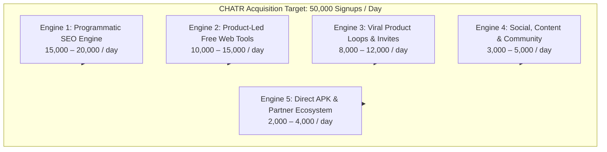
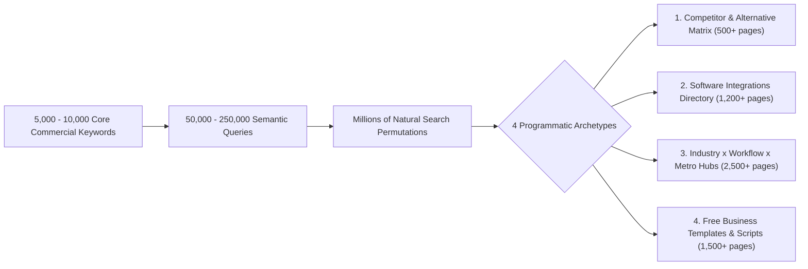
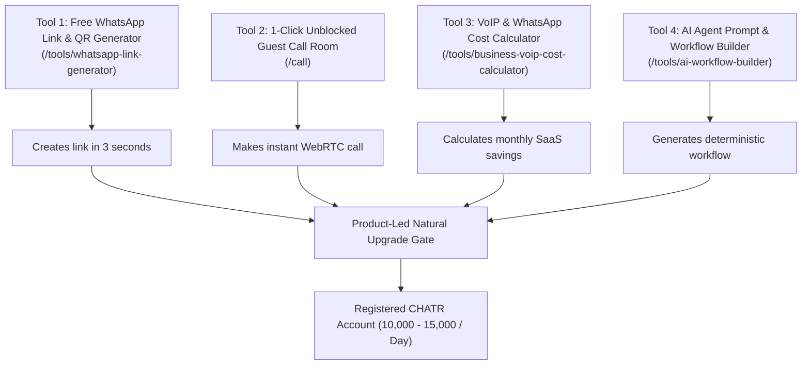
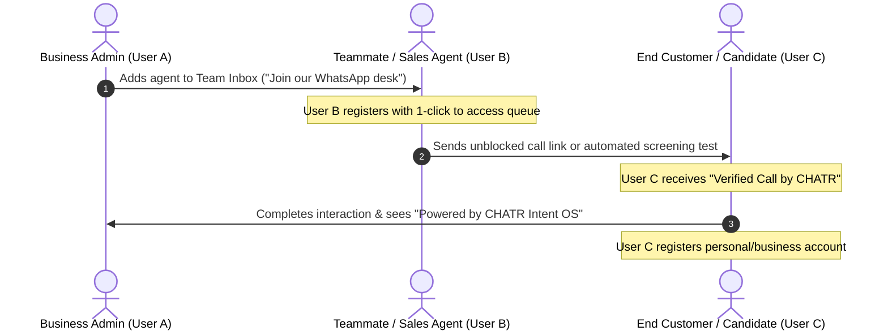
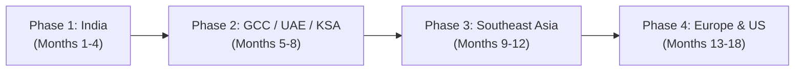
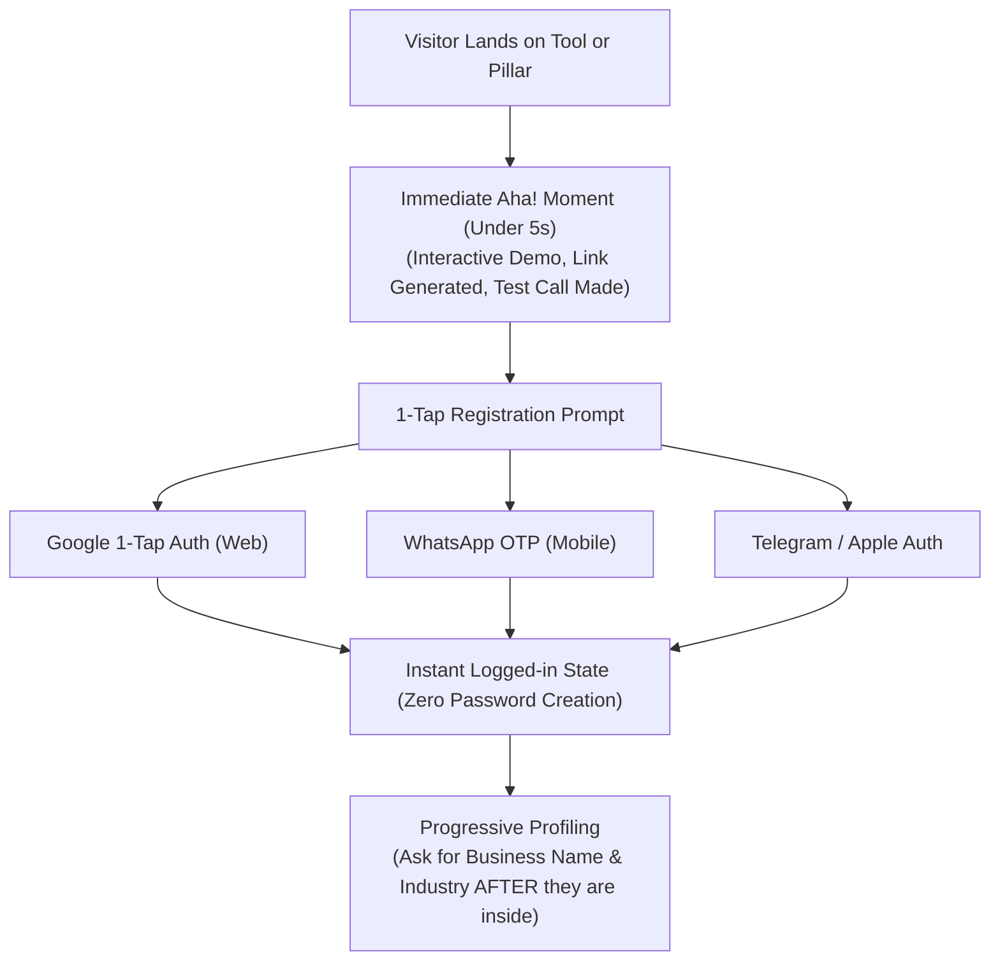
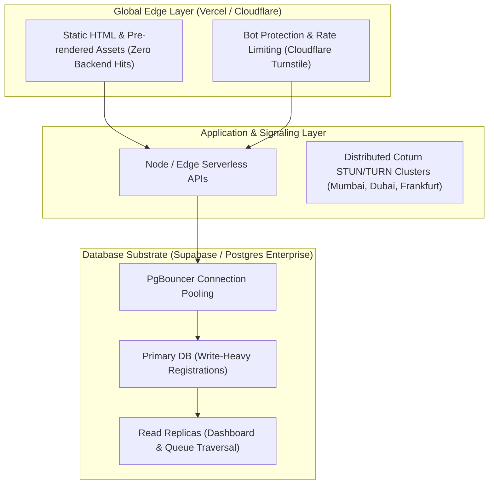
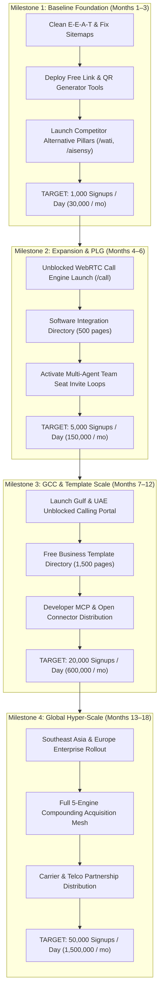

# CHATR Global User Acquisition Engine (50K Registrations/Day)
### Comprehensive Architectural Blueprint & Execution Roadmap

---

## 1. The Mathematical Reality & Channel Breakdown

Targeting **40,000 to 50,000 new user registrations per day** is an enterprise-scale operational paradigm:
* **Daily Registrations:** $50,000 / \text{day}$
* **Monthly Registrations:** $1,500,000 / \text{month}$
* **Annual Scale:** $\approx 18,250,000 / \text{year}$

### The Traffic Mathematics

| Blended Conversion Rate (Visitor $\rightarrow$ Signup) | Daily Qualified Visitors Required | Monthly Web Traffic Required | Comparative Benchmark |
| :---: | :---: | :---: | :---: |
| **1.0%** (Cold Informational Blog / Generic Site) | **5,000,000 / day** | 150,000,000 / mo | Forbes / Healthline scale |
| **2.5%** (Standard SaaS Landing Page) | **2,000,000 / day** | 60,000,000 / mo | Shopify / Canva scale |
| **4.0%** (High-Utility Free Web Tools) | **1,250,000 / day** | 37,500,000 / mo | Smallpdf / Wa.link scale |
| **8.0%** (Bottom-of-Funnel Switchers & Direct Calling) | **625,000 / day** | 18,750,000 / mo | High-intent conversion scale |
| **25.0%** (Collaborative Viral Invites / Team Seat Adds) | **200,000 / day** | 6,000,000 / mo | Slack / Zoom / Calendly viral loop |

### Multi-Engine Distribution Model (Target: 50,000 / Day)

To achieve this sustainably without burning millions in paid ads, acquisition is divided across **five distinct, compounding engines**:

---

## 2. Engine 1: Programmatic & Topic-Cluster SEO (15K–20K Signups/Day)

### The Strategy: From 376 Keywords to a 250,000-Query Search Universe

To generate 15,000–20,000 organic signups daily at an average 3% conversion rate, CHATR needs **500,000 to 650,000 organic visitors/day** (~15M–20M visitors/month).

We execute the **"Ahrefs / Zapier / G2 Playbook"**: building thousands of deeply useful, data-dense landing pages across 4 core archetypes:

### Archetype 1: The Competitor & Alternative Intercept Matrix (500+ High-Intent Pages)
Searchers looking for alternatives already have software budgets, active pain, and immediate intent to buy.
* **Competitors Covered:** WATI, Interakt, Aisensy, Gallabox, Yellow.ai, Gupshup, Twilio, Zendesk, Freshdesk, Dialpad, Vonage, Truecaller, Exotel, JustCall, RingCentral.
* **Permutations per Competitor:**
  * `/[competitor]-alternative` (e.g. `/wati-alternative`, `/interakt-alternative`)
  * `/[competitor]-pricing-breakdown` (e.g. `/wati-pricing-vs-chatr`)
  * `/[competitor]-vs-chatr` (Feature-by-feature side-by-side)
  * `/[competitor]-migration-guide` (e.g. `How to export contacts and migrate to CHATR in 5 minutes`)
* **Conversion Rate:** **6.0% – 10.0%**.

### Archetype 2: The Integration & Connector Playbook (1,200+ High-Intent Pages)
Modelled after Zapier's 50M/month SEO moat. Businesses search how to connect their existing tools to WhatsApp and calling.
* **Query Patterns:**
  * *"How to send WhatsApp message from Shopify on new order"*
  * *"Zoho CRM WhatsApp integration without coding"*
  * *"HubSpot round-robin lead routing to WhatsApp"*
  * *"WooCommerce abandoned cart recovery via WhatsApp API"*
  * *"Google Sheets to WhatsApp automated messaging"*
* **Page Layout:** Above-the-fold 1-click install workflow recipe, payload schema, and interactive test simulation connecting to CHATR's workflow engine.

### Archetype 3: High-Value Industry $\times$ Workflow $\times$ Metro Matrix (2,500 Curated Pages)
We do not index every municipality. We prioritize the top **250 global business hubs** across **10 high-value B2B verticals**:
* **Geographies:**
  * *India:* Mumbai, Delhi-NCR, Bengaluru, Hyderabad, Chennai, Pune, Kolkata, Ahmedabad, Surat, Jaipur.
  * *GCC / Middle East:* Dubai, Abu Dhabi, Riyadh, Jeddah, Doha, Kuwait City, Manama, Muscat.
  * *Southeast Asia:* Singapore, Kuala Lumpur, Jakarta, Manila, Bangkok, Ho Chi Minh City.
  * *Europe & Americas:* London, Frankfurt, Dublin, Amsterdam, New York, San Francisco, Toronto, Sydney.
* **Commercial Verticals:** Recruitment Agencies, Real Estate Brokerages, Healthcare & Polyclinics, Higher Education Admissions, Logistics & Last-Mile, D2C E-Commerce, Financial Services/NBFCs.

### Archetype 4: Free Business Templates & Communication Scripts (1,500 Pages)
* **Query Patterns:**
  * *"WhatsApp message templates for real estate site visits"*
  * *"Candidate interview confirmation WhatsApp template"*
  * *"Payment reminder message templates for B2B clients"*
  * *"Customer service auto-reply scripts for holidays"*
* **Interactive Utility:** Users copy the template with 1 click, or click **"Deploy to CHATR Team Inbox"** to use it instantly.

---

## 3. Engine 2: Product-Led Free Web Tools (10K–15K Signups/Day)

Free browser tools have the lowest customer acquisition cost (CAC) on the internet because search engines rank them for utility, and users share them virally.

### The Top 5 High-Volume Conversion Tools:

1. **Free WhatsApp Link & Dynamic QR Code Generator ([WhatsAppLinkGeneratorTool.tsx](file:///c:/Users/Arshid.Wani/chatrchat/src/pages/public/tools/WhatsAppLinkGeneratorTool.tsx)):**
   * *Search Volume:* **4.5M – 6M searches/month globally**.
   * *User Action:* User generates a `wa.me` link with a pre-filled message.
   * *The Conversion Bridge:* 
     > *"You just generated a link. Who answers when 50 customers click it at once? Upgrade to CHATR Team Inbox: 1 number, unlimited agents, zero missed leads."*

2. **Unblocked WebRTC Instant Calling Room ([GuestCallPage.tsx](file:///c:/Users/Arshid.Wani/chatrchat/src/pages/public/GuestCallPage.tsx)):**
   * *Search Volume:* **2.5M – 3.5M searches/month** (particularly GCC/UAE calling queries).
   * *User Action:* User generates an unblocked temporary browser calling room URL (`chatrchat.in/call/meet-8931`) and sends it to a client or family member.
   * *The Conversion Bridge:* High-definition audio/video connects in 200ms without app install or VPN. End-of-call screen: *"Sign up free to claim your permanent calling link, verified caller ID, and call recorder."*

3. **Enterprise VoIP & Meta Conversation Cost Calculator ([VoipCostCalculatorTool.tsx](file:///c:/Users/Arshid.Wani/chatrchat/src/pages/public/tools/VoipCostCalculatorTool.tsx)):**
   * Computes the exact monthly savings of switching from per-agent markups (WATI/Zendesk) to CHATR's flat ₹999/mo plan.

4. **Interactive Shared Team Inbox Simulator ([InteractiveInboxSimulator.tsx](file:///c:/Users/Arshid.Wani/chatrchat/src/components/seo/InteractiveInboxSimulator.tsx)):**
   * Allows visitors to experience the team inbox, simulate an inbound lead, and watch autonomous SI triage live before signing up.

5. **AI Resume Grader & Screening Questionnaire Builder ([ResumeGraderTool.tsx](file:///c:/Users/Arshid.Wani/chatrchat/src/pages/public/tools/ResumeGraderTool.tsx)):**
   * Recruiter pastes a job description; CHATR generates a 5-question automated WhatsApp screening flow with an instant CTA: *"Deploy this bot to your WhatsApp number now."*

---

## 4. Engine 3: Collaborative Viral Loops & Network Effects (8K–12K Signups/Day)

At 50,000 signups/day, CHATR cannot rely solely on inbound discovery. Every user who enters CHATR must bring other users with them. We engineer a **Viral Coefficient ($K$-Factor)** $> 0.5$:

$$\text{Viral Signups} = \text{Existing Active Users} \times \text{Invites Sent per User} \times \text{Invite Conversion Rate}$$

### The 4 Viral Growth Loops Built into the Product:

1. **The Multi-Agent Workspace Invite Loop (B2B Seat Expansion):**
   * When a business signs up for CHATR Team Inbox, they invite **3 to 15 team members** (sales reps, recruiters, customer support agents).
   * 1 business registration automatically triggers 3–15 high-converting invitation links.

2. **The "Call With Me" Personal WebRTC Link:**
   * Every registered user gets a personal, permanent link: `chatrchat.in/@username`.
   * They put it in their email signatures, LinkedIn bio, and WhatsApp status.
   * Anyone clicking the link makes an unblocked browser call, experiences CHATR's call quality, and sees the CTA to create their own `@username`.

3. **The Candidate / Customer Screening Loop:**
   * When a staffing agency screens candidates using CHATR, hundreds of job applicants interact with the bot daily.
   * At the conclusion of the test, the candidate receives their verified scorecard:
     > *"Scorecard verified by CHATR Trust Shield. Download the CHATR Android App to track your application and receive direct employer calls."*

4. **Verified Caller ID & Anti-Spam Badge:**
   * When an SME calls a customer through CHATR's verified identity runtime, the recipient sees the cryptographic business trust card. This creates brand exposure for CHATR to millions of call recipients daily.

---

## 5. Engine 4 & 5: Social, Developer Ecosystem & Direct APK Distribution

### Engine 4: Developer Ecosystem & Open Connectors (3K–5K Signups/Day)
* **Model Context Protocol (MCP) & Agent Connectors:** Publish open-source connectors for Claude, Cursor, LangChain, and AutoGen (`npx chatr-mcp-server`), allowing developers to use CHATR for automated telephony and messaging.
* **First-Party Benchmark Reports:** Continue publishing annual industry research ([researchReportsData.ts](file:///c:/Users/Arshid.Wani/chatrchat/src/data/researchReportsData.ts)) to earn high-authority backlinks and organic citations from tech publications.

### Engine 5: Direct Android APK Distribution (2K–4K Signups/Day)
* Direct download at `/download/android` targeting search terms like:
  * *"download chatr apk"*
  * *"caller id app without sharing contacts"*
  * *"private dialer apk direct download"*
* Circumvents app store restrictions and captures direct mobile installations with zero ad spend.

---

## 6. Geographic Phased Expansion Strategy

To hit 50K registrations daily, CHATR systematically executes a multi-country rollout based on messaging penetration and VoIP regulation:

| Region | Primary Hook | Dominant Competitors to Displace | Daily Volume Potential |
| :--- | :--- | :--- | :--- |
| **1. India** | Multi-Agent WhatsApp API, ₹999 flat pricing, Truecaller private alternative | WATI, Interakt, Aisensy, Truecaller | **20,000 – 25,000 / day** |
| **2. GCC / UAE / Saudi** | Unblocked browser WebRTC calling without VPN, cross-border trade messaging | Botim, WhatsApp Call blocking, local telcos | **12,000 – 15,000 / day** |
| **3. Southeast Asia** (ID, MY, PH, VN) | Social commerce team inbox, COD order confirmation, low-data WebRTC | SleekFlow, Respond.io | **8,000 – 10,000 / day** |
| **4. Europe & North America** | AI Receptionist, Intent OS workflow automation, Developer API | Dialpad, OpenPhone, Twilio, Zendesk | **5,000 – 8,000 / day** |

---

## 7. Conversion Funnel Optimization: Eliminating Churn

A high-traffic funnel with a leaking registration screen will never hit 50K/day. The signup flow is engineered for sub-5-second completion:

### Key Funnel Invariants:
1. **Never ask for passwords:** Rely strictly on Google 1-Tap, WhatsApp OTP, and WebAuthn.
2. **Never gate the core utility:** Allow users to generate the link, calculate their savings, or start the test call *before* showing the signup dialog.
3. **Progressive Profiling:** Capture the account registration with a single click. Collect company details, seat count, and phone numbers *in-app* during activation.

---

## 8. Infrastructure Capacity Plan for 1.5M Users/Month

Handling 50,000 registrations/day means scaling the system to support **1.5 million new user records every 30 days**, along with their associated threads, contacts, and WebRTC signaling sessions:

1. **Pre-rendered Edge Delivery:** 95%+ of incoming traffic hits pre-rendered static HTML on the edge CDN (`scripts/prerender-seo.cjs`). Backend servers only process actual registration API calls and WebRTC handshakes.
2. **Database Write Sharding:** User authentication, identity credentials, and workspace mappings utilize connection pooling (`PgBouncer`) and UUIDv7 chronological primary keys to avoid index fragmentation during high-velocity write bursts (50+ registrations/minute).
3. **WebRTC STUN/TURN Cluster:** Distributed TURN relays deployed across **Mumbai, Dubai, Singapore, and Frankfurt** to maintain $<80\text{ms}$ audio latency for unblocked browser calling.

---

## 9. Phased Execution Roadmap: From Current Baseline to 50K/Day

### Summary of Targets:

| Milestone | Timeframe | Primary Focus | Daily Signups | Monthly Run-Rate |
| :--- | :--- | :--- | :--- | :--- |
| **Milestone 1** | **Months 1–3** | Launch high-converting free tools (`/tools/*`), prune low-signal sitemaps, scale competitor alternative pages. | **1,000 / day** | 30,000 / mo |
| **Milestone 2** | **Months 4–6** | Deploy unblocked WebRTC guest calling (`/call`), activate multi-agent team seat invites, expand integrations directory. | **5,000 / day** | 150,000 / mo |
| **Milestone 3** | **Months 7–12** | Scale GCC/UAE unblocked calling, deploy 1,500+ free message templates, launch open-source MCP connectors. | **20,000 / day** | 600,000 / mo |
| **Milestone 4** | **Months 13–18** | Full multi-engine compounding: SEO + Free Tools + Viral Referral Loops across India, GCC, SE Asia, and Global. | **50,000 / day** | **1,500,000 / mo** |

---

### Master Principle
The objective is officially established as the **CHATR Global User Acquisition Engine (50K/Day)**. By orchestrating Programmatic SEO, Product-Led Web Tools, and Organic Viral Loops simultaneously, CHATR avoids reliance on any single channel and establishes a mathematical path to 1.5M new users every month.
