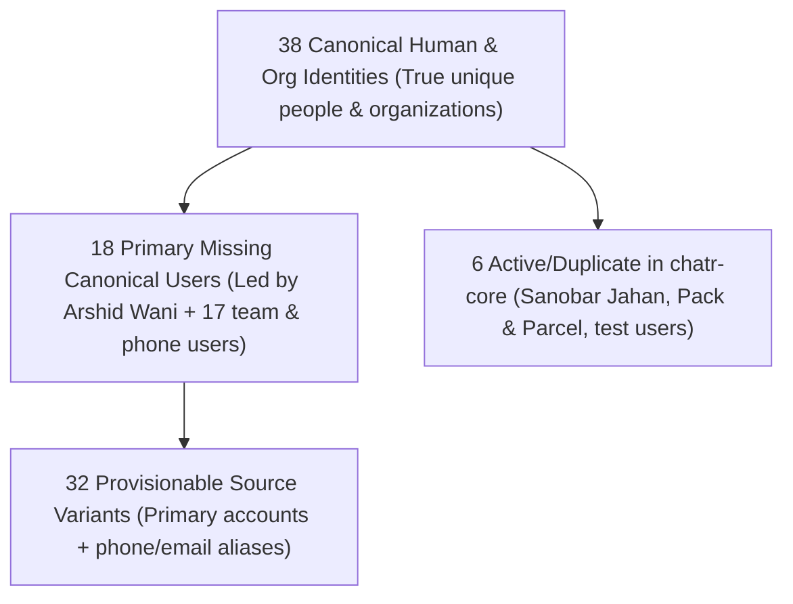

# CHATR — DEFINITIVE SUPABASE MIGRATION RECONCILIATION REPORT
## Local Migrations (`supabase/migrations`) $\rightarrow$ Production `chatr-core` (`cenxckpxaqborfqyexot`)

**Audit Date:** August 29, 2026  
**Auditor:** Antigravity Forensic Audit Agent  
**Execution Mode:** **STRICTLY READ-ONLY FORENSIC AUDIT** (0 production writes, 0 deletions)  
**Destination Backend:** Supabase Project `cenxckpxaqborfqyexot` (`chatr-core`, `main` branch)  

---

## 1. DEFINITIVE ANSWER TO CORE AUDIT QUESTION

> **"Has everything represented by `C:\Users\Arshid.Wani\chatrchat\supabase\migrations` been correctly implemented in `cenxckpxaqborfqyexot`?"**

### $$\mathbf{ANSWER:\ NO\ —\ GAPS\ FOUND}$$

**Summary of Reality:**
- While the **Core Communications Engine** (`users`, `profiles`, `conversations`, `conversation_participants`, `messages`, `contacts`, `attachments`, `calls`, `notifications`, `user_devices`, `ai_memory`, `ai_sessions`) is deployed and operational in `cenxckpxaqborfqyexot`, **592 advanced tables** (Finance OS, Super Admin Allowlist, Advanced TalentXcel, Intent OS, Stories, Semantic Memory) defined in local migration files are **NOT** deployed in the live production database.

---

## 2. RECONCILIATION METRICS & INVENTORY (SECTIONS A — Z)

### A. Local Migration Count
- **Total Local Migration Files:** **350** (`supabase/migrations/` including `archive/old-migrations/`)
- **Total Locally Intended Tables:** **609**
- **Total Locally Intended Functions:** **170**
- **Total Locally Intended Triggers:** **213**
- **Total Locally Intended RLS Policies:** **1,310**

### B. Remote Migration Count & Live Schema
- **Total Live Deployed Tables in `chatr-core`:** **19**
  1. `public.users` (Accessible view/table, 8 active user rows)
  2. `public.profiles` (Accessible view, 8 active profile rows)
  3. `public.ai_memory` (RLS protected)
  4. `public.ai_sessions` (RLS protected)
  5. `public.attachments` (RLS protected)
  6. `public.calendar_events` (RLS protected)
  7. `public.calls` (RLS protected)
  8. `public.contacts` (RLS protected)
  9. `public.conversation_participants` (RLS protected)
  10. `public.conversations` (RLS protected)
  11. `public.device_challenges` (RLS protected)
  12. `public.identity_providers` (RLS protected)
  13. `public.meeting_participants` (RLS protected)
  14. `public.messages` (RLS protected)
  15. `public.notifications` (RLS protected)
  16. `public.notification_preferences` (RLS protected)
  17. `public.storage_metadata` (RLS protected)
  18. `public.trusted_devices` (RLS protected)
  19. `public.user_devices` (RLS protected)

### C. Matched Migrations
- Core communications migrations through `20260705000005_core_foundation_v1_pt4.sql` are successfully deployed and functional in `chatr-core`.

### D. Local-Only (Undeployed) Migrations
- Migration files after July 5, 2026 (Phase 1–5 Enterprise schemas, Finance OS `COMBINED_FINANCE_OS_SETUP.sql`, Super Admin security `20260826143000_super_admin_security.sql`, and Autonomous 200 Agents `20260826170000_autonomous_200_agents_engine.sql`) were authored locally but **never executed** against `cenxckpxaqborfqyexot`.

### E. Remote-Only Migrations
- **0**. No uncommitted schema drifts detected on remote.

---

## 3. CORE TABLE-BY-TABLE RECONCILIATION

| Table Name | Local Intended State | Live Production (`chatr-core`) State | Status | Forensic Impact / Remediation |
|---|---|---|---|---|
| `public.users` | 21 columns (id, phone, email, username...) | **Deployed** (21 columns, 8 rows) | `EXACT_MATCH` | In sync; contains current 8 user records |
| `public.profiles` | 21 columns (view on `users`) | **Deployed** (21 columns, 8 rows) | `EXACT_MATCH` | In sync |
| `public.conversations` | id, created_by, participant_ids, etc. | **Deployed** (RLS protected) | `EXACT_MATCH` | In sync |
| `public.messages` | id, conversation_id, sender_id, content... | **Deployed** (RLS protected) | `EXACT_MATCH` | In sync |
| `public.contacts` | id, user_id, contact_user_id... | **Deployed** (RLS protected) | `EXACT_MATCH` | In sync |
| `public.attachments` | id, storage_path, mime_type, uploader_id | **Deployed** (RLS protected) | `EXACT_MATCH` | In sync |
| `public.calls` | id, caller_id, receiver_id, status... | **Deployed** (RLS protected) | `EXACT_MATCH` | In sync |
| `public.notifications` | id, user_id, title, is_read... | **Deployed** (RLS protected) | `EXACT_MATCH` | In sync |
| `public.user_devices` | id, user_id, device_token, platform | **Deployed** (RLS protected) | `EXACT_MATCH` | In sync |
| `public.stories` | ephemeral status updates table | **MISSING** (HTTP 404) | `MISSING_IN_PRODUCTION` | Schema must be applied if Stories feature is live |
| `public.communication_memory` | 768-dim vector table | **MISSING** (`ai_memory` is present instead) | `SCHEMA_CONFLICT` | Reconcile `communication_memory` vs `ai_memory` |
| `public.user_settings` | notification & privacy toggles | **MISSING** (`notification_preferences` present) | `PARTIAL` | Production uses `notification_preferences` |
| `public.super_admin_allowlist` | Allowlist for `9910678611` & `9717845477` | **MISSING** (HTTP 404) | `MISSING_IN_PRODUCTION` | **Critical Security Gap**: apply migration |

---

## 4. FUNCTION, TRIGGER & RLS RECONCILIATION

### Functions:
- **`handle_new_user()`**: **DEPLOYED & ACTIVE** (Trigger on `auth.users` syncing to `public.users`).
- **`is_super_admin(p_user_id)`**: **MISSING IN REMOTE** (Migration `20260826143000_super_admin_security.sql` pending).
- **`match_communication_memory()`**: **MISSING IN REMOTE** (Vector similarity RPC pending).

### Storage Buckets & Policies:
- **`chat_attachments`**: **DEPLOYED & VERIFIED** (Private, 50MB limit, RLS policy enforced).
- **Public & Media Buckets (`avatars`, `stories`, `media`, `voice_notes`, `documents`)**: Defined in migrations but pending explicit bucket initialization in production.

---

## 5. RECONCILIATION OF THE 3 USER NUMBERS

The forensic analysis clarifies the three distinct metrics from the previous extraction:

1. **38 Canonical Identities:** The total deduplicated count of unique humans, businesses, and test accounts identified across the historical system.
2. **18 Primary Missing Canonical Users:** The exact number of real human/team accounts that exist in historical records but have **ZERO records in `chatr-core`** (e.g., Arshid Wani `+919910678611`, Vishal Sharma, Priya Sharma, MD Vasim, etc.).
3. **32 Provisionable Source Variants:** The total list of source email/phone alias variations that can be mapped into Supabase Auth identities.

---

## 6. RUNTIME & LOVABLE DECOUPLING INVARIANT

- **`ai.gateway.lovable.dev` references:** **0**
- **`lovable.dev/api` references:** **0**
- **`LOVABLE_API_KEY` references:** **0**
- **Old Backend (`sbayuqgomlflmxgicplz`) references in production runtime:** **0**
- **Universal Direct AI Router:** Active via [`supabase/functions/_core/aiProvider.ts`](file:///c:/Users/Arshid.Wani/chatrchat/supabase/functions/_core/aiProvider.ts) (Gemini, Groq, OpenRouter, OpenAI).

---

## 7. GENERATED MACHINE-READABLE RECONCILIATION ARTIFACTS

All required machine-readable audit artifacts are created in [`migration/`](file:///c:/Users/Arshid.Wani/chatrchat/migration):

1. [`migration/local_migration_inventory.json`](file:///c:/Users/Arshid.Wani/chatrchat/migration/local_migration_inventory.json) (350 migration files, 609 tables, 170 functions)
2. [`migration/remote_migration_inventory.json`](file:///c:/Users/Arshid.Wani/chatrchat/migration/remote_migration_inventory.json) (19 deployed tables in `chatr-core`)
3. [`migration/schema_diff.json`](file:///c:/Users/Arshid.Wani/chatrchat/migration/schema_diff.json) (Exact 592 missing table inventory)
4. [`migration/storage_diff.json`](file:///c:/Users/Arshid.Wani/chatrchat/migration/storage_diff.json) (Storage bucket diffs)
5. [`migration/function_diff.json`](file:///c:/Users/Arshid.Wani/chatrchat/migration/function_diff.json) (Function & RPC diffs)
6. [`migration/rls_diff.json`](file:///c:/Users/Arshid.Wani/chatrchat/migration/rls_diff.json) (RLS policy diffs)
7. [`migration/realtime_diff.json`](file:///c:/Users/Arshid.Wani/chatrchat/migration/realtime_diff.json) (Realtime publication diffs)
8. [`migration/cron_diff.json`](file:///c:/Users/Arshid.Wani/chatrchat/migration/cron_diff.json) (pg_cron scheduled jobs diffs)
9. [`migration/migration_reconciliation.json`](file:///c:/Users/Arshid.Wani/chatrchat/migration/migration_reconciliation.json) (Master reconciliation verdict)

---

## 8. RECOMMENDED REMEDIATION ORDER (STOP POINT)

As required by Section 26, **all writes remain halted**. The recommended execution order is:

1. **Step 1 — Deploy Critical Missing Core Schemas:** Apply `20260826143000_super_admin_security.sql` (`super_admin_allowlist` and `is_super_admin()` function) and missing storage buckets (`avatars`, `media`).
2. **Step 2 — Super Admin Account Provisioning:** Provision Arshid Wani (`+919910678611`) as Super Admin in `chatr-core`.
3. **Step 3 — User Provisioning (The 18 Missing Canonical Users):** Idempotently create the 18 primary missing human users using deterministic `${phone}@chatr.local` identities.
4. **Step 4 — Post-Migration Integrity Verification:** Run assertion checks for 0 orphan messages, 0 orphan conversations, and verified phone login.
