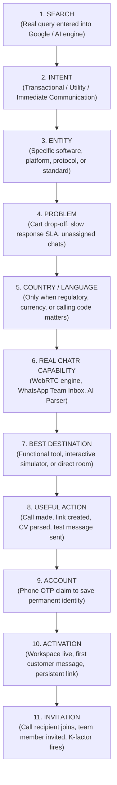

# CHATR STRATEGY — DEMAND-DRIVEN ARCHITECTURE & K-FACTOR ENGINE
## Operational Doctrine: Bridging Stage 1 Validation to 40,000–50,000 Activated Users/Day

> **EXECUTIVE HARD GATE (EFFECTIVE IMMEDIATELY):**  
> **NO MASS pSEO GENERATION UNTIL STAGE 1 PROVES PRODUCT-LED CONVERSION.**  
> All theoretical 37,500-page integration matrices and 150,000-page calculator calculations are officially **LOCKED BEHIND THIS GATE**. Engineering is strictly barred from auto-generating programmatic pages until the Stage 1 conversion loop produces verified, activated users.

---

## 1. The Core Hard Rules & Operational Guardrails

### Rule 1: The Functionality Mandate for Integrations
> **Never publish an integration page unless the integration actually works in production.**

* **The Anti-Pattern (BANNED):** Creating a page titled *"CHATR + Shopify WhatsApp Integration"* with a generic marketing description and a blank *"Sign Up"* button that dumps the user into an empty workspace. This replicates the exact location-page intent mismatch that produced 0 customers.
* **The Required Standard:** If CHATR publishes an integration destination for an entity (e.g., Shopify, Zoho, WooCommerce), the user must be able to **execute a real, functional action** immediately:
  - Connect their store / API key or webhook in the browser.
  - Test a real abandoned cart or order tracking message preview.
  - See active live state before creating a persistent account.

### Rule 2: Unverified Search Numbers are Hypotheses, Not Facts
Keyword search volumes (e.g., 18,100/mo, 45,000/mo) provided in strategic briefs are **unverified external estimates**. They must be treated strictly as hypotheses until validated by:
1. Google Search Console actual impressions on verified test pages.
2. First-party query log demand.
3. User behavior demonstrating that the query carries **transactional or immediate utility intent**.

---

## 2. The 11-Step Intent-to-Activation Architecture

Instead of the naive $\text{1 Keyword} = \text{1 Page}$ permutation model, CHATR operates under an authoritative 11-step resolution chain that handles millions of potential search phrases through a compact, high-utility destination graph:



---

## 3. The Mathematical Inversion: Traffic Hunting vs. Conversion & Network Effects

The common mistake is assuming that reaching 50,000 signups/day requires 1,000,000 external visitors/day at a standard 5% conversion rate.

The true strategic lever is **inverting the funnel**:

$$\text{External Visitors Required} = \frac{\text{Target Daily Signups} \times (1 - \text{Network Share})}{\text{Landing Conversion Rate}}$$

| Landing Conversion | Network Virality ($K$) | External Visitors Needed / Day | Monthly Traffic Target | Feasibility |
| :---: | :---: | :---: | :---: | :---: |
| **5%** (Generic SaaS) | $0.00$ (No virality) | **1,000,000** | 30,000,000 | Extreme difficulty / Requires massive budget |
| **10%** (Interactive Tool) | $0.15$ (Weak invites) | **425,000** | 12,750,000 | High effort |
| **15%** (Instant Utility) | $0.35$ (Call receiver loop) | **216,667** | 6,500,000 | Realistic mid-stage target |
| **25%** (Product-Led /call) | **0.50** (Every 2 users bring 1) | **100,000** | 3,000,000 | **Highly defensible, capital-efficient** |

**Strategic Focus:** Minimizing the external traffic required per activated user by maximizing **in-product utility conversion** (15%–25%) and **network propagation ($K$)** is $10\times$ more valuable than trying to buy or scrape 33 Million search impressions/day.

---

## 4. The $K$-Factor Viral Measurement Engine

Virality must not be assumed; it must be measured cohort by cohort on the `/growth` control room:

$$K = \frac{\text{New Activated Users Generated by Existing Users}}{\text{Existing Active Cohort}}$$

### Viral Health Benchmarks
* **$K < 0.10$ (Dead Loop):** Invites are ignored. The product is treated as a single-player utility. Optimization must focus on the receiver experience.
* **$K \approx 0.20 – 0.35$ (Healthy Growth Assist):** Network effects significantly reduce customer acquisition costs (CAC).
* **$K \ge 0.50$ (Powerful Multiplier):** Organic word-of-mouth and recipient onboarding cut the required SEO traffic in half.
* **$K \ge 1.00$ (Self-Propagating Virality):** The user base expands autonomously without incremental external marketing.

### Cohort Progression Tracking
Every day, the system measures:
$$\text{Active Users} \longrightarrow \text{Invites / Links Sent} \longrightarrow \text{Links Delivered} \longrightarrow \text{Joined Sessions} \longrightarrow \text{Accounts Claimed} \longrightarrow \text{Activated Receivers}$$

---

## 5. The Phased Scaling Ladder

```
┌─────────────────────────────────────────────────────────────────────────┐
│                        THE 5-PHASE SCALING LADDER                       │
├─────────┬──────────────────────┬────────────────────────────────────────┤
│ PHASE   │ TARGET DAILY USERS   │ FOCUS & GATING CONDITIONS              │
├─────────┼──────────────────────┼────────────────────────────────────────┤
│ Phase 0 │ Validation (Current) │ /call claim loop + core web tools.     │
│         │                      │ Prove: session → OTP → activation.     │
├─────────┼──────────────────────┼────────────────────────────────────────┤
│ Phase 1 │ 10 → 100 / day       │ Product-Market Signal. Clean cohort    │
│         │                      │ retention; receiver-to-account loop.   │
├─────────┼──────────────────────┼────────────────────────────────────────┤
│ Phase 2 │ 100 → 1,000 / day    │ Distribution via best-performing loops.│
│         │                      │ 20–50 fully working integrations.      │
├─────────┼──────────────────────┼────────────────────────────────────────┤
│ Phase 3 │ 1,000 → 10,000 / day │ Verified demand expansion. Validated   │
│         │                      │ GSC search data + country calculators. │
├─────────┼──────────────────────┼────────────────────────────────────────┤
│ Phase 4 │ 10K → 50,000 / day   │ Compounding scale. High domain author- │
│         │                      │ ity + $K \ge 0.5$ + business API.      │
└─────────┴──────────────────────┴────────────────────────────────────────┘
```

---

## 6. Immediate Operational Mandate for Engineering

1. **NO NEW MASS PAGES:** The page generation pipeline remains strictly frozen.
2. **MONITOR VALIDATION DAY 1:** Collect clean, untainted behavioral telemetry from the 44 newly standardized public pages, `/call` claim dialogs, and tool generation flows.
3. **REPORT CLEAN FUNNEL METRICS:** Track Completed Calls $\rightarrow$ Claim Prompts $\rightarrow$ OTP Verified $\rightarrow$ Permanent Links $\rightarrow$ Team Invites $\rightarrow$ Live Workspaces.
