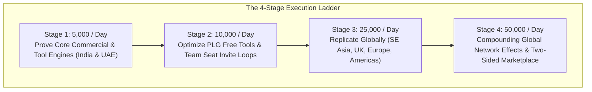
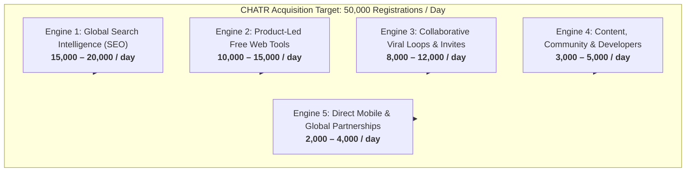
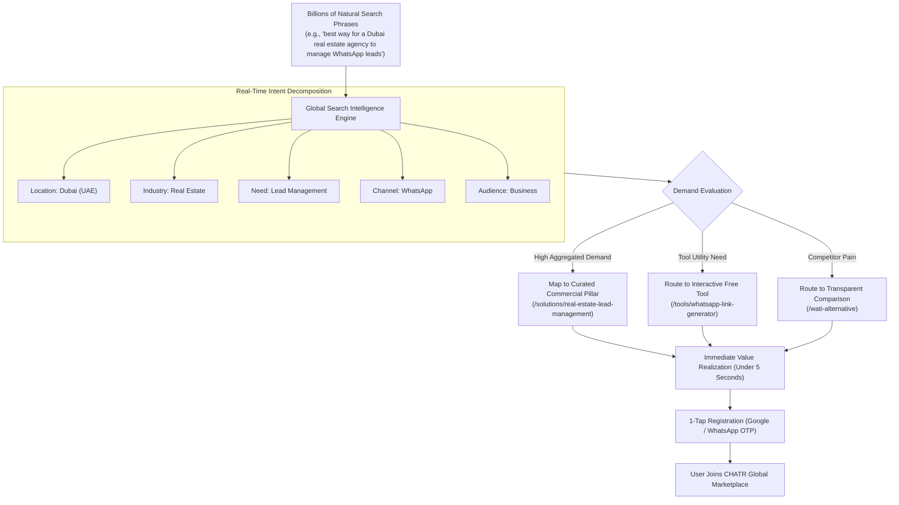
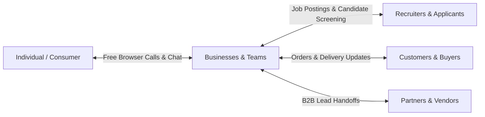
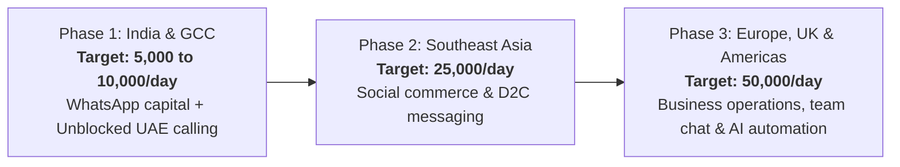
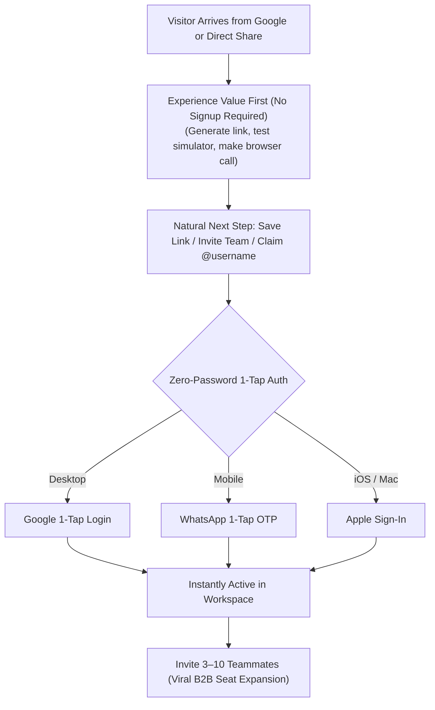

# CHATR Global User Acquisition Engine
## Master Architecture: 40,000–50,000 New Registrations / Day
### The World is the Marketplace • Zero Technical Jargon • Multi-Engine Global Scale

---

## 1. The Core Law: Zero Customer Jargon

> **Inside CHATR:** Deep systems engineering, real-time protocols, automated DAGs, and rigorous execution substrates.  
> **In front of Customers:** 100% human language. Zero engineering jargon.

Customers must understand CHATR in **5 seconds**:
$$\mathbf{Chat. \;\; Call. \;\; Sell. \;\; Support. \;\; Automate. \;\; One \; place.}$$

```mermaid
flowchart LR
    subgraph TechnicalReality["Inside CHATR (Engineering Truth)"]
        direction TB
        T1["WebRTC Peer Mesh & Coturn"]
        T2["Intent-to-DAG Kernel Compiler"]
        T3["GSC Search Analytics & JSON-LD"]
        T4["Meta Cloud API & SIP Signaling"]
    end

    subgraph CustomerLanguage["In Front of Customers (Human Truth)"]
        direction TB
        C1["Make free browser calls without installing software"]
        C2["Automate repetitive daily customer tasks"]
        C3["One inbox for your team to reply to customer messages"]
        C4["Connect your business number and never miss a lead"]
    end

    TechnicalReality -->|Zero Jargon Translation| CustomerLanguage
```

### Customer-Facing Positioning Matrix

| Audience | What We Never Say (Forbidden Jargon) | What We Say (Human Benefit) |
| :--- | :--- | :--- |
| **Business Owners & Teams** | *"Intent Operating System, Universal Inbox, WebRTC telephony, autonomous SI triage"* | **"Bring your team, customer conversations, calls and daily work into one simple workspace."** |
| **Everyday Individuals** | *"Cryptographic caller identity, peer-to-peer WebRTC mesh, intent runtime"* | **"Chat and call people easily from one place. Free browser calls, zero downloads."** |
| **Google Search Results (SERP)** | *"CHATR — The Intent Operating System & Universal Communication Infrastructure"* | **"CHATR — Team Chat, Customer Calls & AI Automation"** |
| **Calling Feature (/call)** | *"WebRTC voice/video session signaling with STUN/TURN traversal"* | **"Make free voice and video calls directly from your browser. No app to download. No VPN needed."** |
| **Team Inbox (/whatsapp-team-inbox)** | *"Multi-agent official WhatsApp Cloud API connector with automated SI collision locks"* | **"One WhatsApp number for your entire team. Share customer messages, route leads, and reply in seconds."** |

---

## 2. The Scale: The 50,000 Registrations / Day Mathematical Reality

Targeting **40,000 to 50,000 new registrations every day** means scaling to **1.2 to 1.5 million new registered users every month** (~18 million/year).

At this scale, CHATR cannot be treated as a traditional SEO blog or a regional tool. It is a **global search-and-discovery network**:

### The 5 Compounding Growth Engines

---

## 3. The Global Search Intelligence Engine (Billions of Search Variations $\neq$ Billions of Thin Pages)

The fundamental architectural principle:
> **Do NOT build an artificial page factory spitting out millions of thin city templates.**  
> **Build a Global Search Intelligence Engine that understands what people want and routes them to the best high-utility CHATR experience.**

### The 5 Core Search Solution Hubs
Instead of thousands of fragmented URLs, all search variations resolve into **curated, authoritative destination hubs**:
1. **The Customer Messaging Hub:** Multi-agent shared inboxes, automated replies, lead routing, team collision protection.
2. **The Instant Calling Hub:** Free browser calling, unblocked calling across Gulf/UAE/Worldwide, personal calling links (`/@username`).
3. **The Work Automation Hub:** AI lead qualification, automatic scheduling, candidate screening, customer follow-ups.
4. **The Free Utilities Hub:** Click-to-chat link generators, dynamic QR creators, VoIP cost calculators, message templates.
5. **The Competitor Switcher Hub:** Source-verifiable pricing and feature comparisons against WATI, Interakt, Aisensy, Truecaller, and legacy telecom.

---

## 4. The Two-Sided Marketplace Flywheel

CHATR is not just a software funnel ($Google \rightarrow Visitor \rightarrow Signup$). It is a **two-sided global network** where every participant brings other participants:

### The 5 Participant Entry Gates
* **A person** joins to make a free unblocked call to family or friends abroad.
* **A small business** joins to connect their official WhatsApp number so 5 employees can share the inbox.
* **A recruiter** joins to automate WhatsApp candidate screening and resume scoring.
* **A customer** joins when clicking a business's CHATR calling link or tracking their delivery.
* **A developer** joins to automate telephony and messaging via open APIs and MCP connectors.

*Every single interaction terminates in an invite to the CHATR network.*

---

## 5. Global Geographic Phased Rollout

CHATR is engineered globally from Day 1:

| Region | Primary Human Problem Solved | Key Markets |
| :--- | :--- | :--- |
| **1. India** | Businesses losing sales because multiple staff cannot access one WhatsApp number. High competitor markups. | Mumbai, Delhi-NCR, Bengaluru, Hyderabad, Chennai, Pune. |
| **2. GCC / Middle East** | High demand for free, unblocked browser calls without VPNs. Cross-border trade communication. | Dubai, Abu Dhabi, Riyadh, Jeddah, Doha, Kuwait, Muscat. |
| **3. Southeast Asia** | High volume of social commerce orders requiring WhatsApp/chat confirmations and COD verification. | Jakarta, Manila, Kuala Lumpur, Bangkok, Ho Chi Minh City. |
| **4. Europe & Americas** | High cost of legacy phone systems (RingCentral/Dialpad) and fragmented business tools. | London, Frankfurt, Dublin, New York, San Francisco, Toronto. |

---

## 6. Eliminating Friction: The Sub-5-Second Activation Rule

1. **Never make customers type passwords:** Rely strictly on Google 1-Tap, WhatsApp OTP, and WebAuthn.
2. **Never gate the free utility:** Let visitors create the WhatsApp link or place the test call *before* prompting to register.
3. **Progressive Profiling:** Collect business details *after* value has been delivered, inside the active workspace.

---

## 7. Immediate Execution Checklist

- [x] **Remove technical jargon from root surfaces:** [`index.html`](file:///c:/Users/Arshid.Wani/chatrchat/index.html) updated to `"CHATR — Team Chat, Customer Calls & AI Automation"`.
- [x] **Clean prerendered metadata:** [`scripts/prerender-seo.cjs`](file:///c:/Users/Arshid.Wani/chatrchat/scripts/prerender-seo.cjs) updated to eliminate "SI intent triage" and "WebRTC".
- [x] **Establish live GSC engine:** [`scripts/gsc-opportunity-analyzer.cjs`](file:///c:/Users/Arshid.Wani/chatrchat/scripts/gsc-opportunity-analyzer.cjs) verified with real GSC API data.
- [ ] **Deploy 1-Tap Google / WhatsApp Authentication** on high-traffic free tools ([`WhatsAppLinkGeneratorTool.tsx`](file:///c:/Users/Arshid.Wani/chatrchat/src/pages/public/tools/WhatsAppLinkGeneratorTool.tsx) and [`GuestCallPage.tsx`](file:///c:/Users/Arshid.Wani/chatrchat/src/pages/public/GuestCallPage.tsx)).
- [ ] **Launch canonical solution hubs** for hotel messaging and e-commerce tracking to reclaim lost GSC queries.
- [ ] **Activate B2B Team Seat Invites** in the main user workspace to unlock viral compounding.
