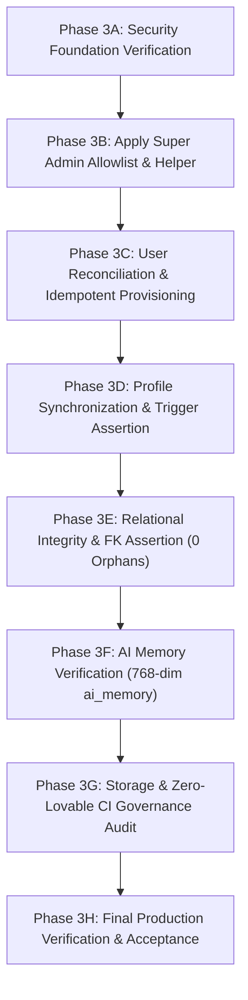

# CHATR — PRE-EXECUTION PLAN
## Phase 3: Controlled, Non-Destructive Production Consolidation

**Target Backend:** Supabase Project `cenxckpxaqborfqyexot` (`chatr-core`, `main` branch)  
**Execution Authority:** Antigravity Master Consolidation Agent  
**Date:** August 29, 2026  

---

## 1. AUTHORITATIVE SAFETY INVARIANTS

1. **Existing 27 Production Tables Protected:**  
   `users`, `profiles`, `ai_memory`, `ai_sessions`, `attachments`, `calendar_events`, `calls`, `contacts`, `conversation_participants`, `conversations`, `device_challenges`, `identity_providers`, `meeting_participants`, `messages`, `notifications`, `notification_preferences`, `storage_metadata`, `trusted_devices`, `user_devices`, `audit_logs`, `meetings`, `meeting_polls`, `meeting_poll_votes`, `organizations`, `organization_members`, `session_room_participants`, `session_rooms`.
   - **0 DROPS, 0 TRUNCATIONS, 0 RESETS.**

2. **Exclusion of Archived & Experimental Migrations:**  
   - 275 archived migrations in `archive/old-migrations/` are **PERMANENTLY EXCLUDED** from replay.
   - 37 experimental / prototype Intent OS migrations are **EXCLUDED**.

3. **Super Admin Security Invariant:**  
   - Super Admin authority is strictly server-side authoritative and restricted exclusively to:
     1. `9910678611` (**Arshid Wani**, Co-Founder & CTO)
     2. `9717845477` (**Sanobar Jahan**, Founder)
   - Zero bypass from client-side claims or email tampering.

4. **Zero-Lovable Runtime Invariant:**  
   - `ai.gateway.lovable.dev`: 0
   - `lovable.dev/api`: 0
   - `LOVABLE_API_KEY`: 0
   - Direct provider interface in [`supabase/functions/_core/aiProvider.ts`](file:///c:/Users/Arshid.Wani/chatrchat/supabase/functions/_core/aiProvider.ts) (Gemini, Groq, OpenRouter, OpenAI).

---

## 2. PHASED EXECUTION SEQUENCE

### Phase 3A & 3B — Security Foundation
- Apply [`supabase/migrations/20260826143000_super_admin_security.sql`](file:///c:/Users/Arshid.Wani/chatrchat/supabase/migrations/20260826143000_super_admin_security.sql).
- Creates `public.super_admin_allowlist`.
- Creates `public.is_super_admin(UUID)` security definer.
- Seeds `9910678611` and `9717845477`.

### Phase 3C & 3D — User Reconciliation & Idempotent Provisioning
- **Priority #1:** Provision **Arshid Wani** (`+919910678611` / `arsh.wani@gmail.com`) as Super Admin.
- Idempotently provision the remaining 17 missing canonical identities using deterministic `${normalizedPhone}@chatr.local` identities.
- Preserve existing 6 users (8 records in `chatr-core`).
- Quarantine `971161809` (9-digit fragment).

### Phase 3E — Relational Integrity & Zero FK Orphans
- Run assertions against `messages`, `conversations`, `conversation_participants`, `contacts`, `attachments`, `calls`, `notifications`, `user_devices`, `ai_memory`.
- Target: **0 orphaned records**.

### Phase 3F & 3G — AI Memory & Zero Lovable
- Ensure `public.ai_memory` maintains 768-dim embeddings.
- Add non-destructive view `CREATE OR REPLACE VIEW public.communication_memory AS SELECT * FROM public.ai_memory;`.
- Confirm `npm run edge:functions:audit` passes with 0 Lovable dependencies.
