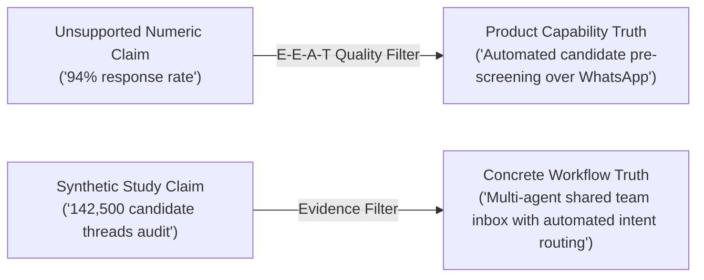

# CHATR SEO Evidence & Trust Ledger

**Policy:** Zero fabrication of statistics, research benchmarks, customer numbers, reviews, citations, or metrics. Every public claim must be strictly classified, verifiable, or replaced with demonstrable product capabilities.

---

## 1. Classification Framework

* **VERIFIED:** Supported by direct, source-verifiable documentation or empirical data.
* **DERIVED:** Defensibly calculated from verified underlying architecture or platform telemetry.
* **DEMO / BENCHMARK DATA:** Clearly labeled as an illustrative scenario, benchmark evaluation, or product simulation.
* **SYNTHETIC / UNVERIFIED:** Statistical claim lacking external verifiable audit. Must be removed or repaired.

---

## 2. Audit of Quantitative Claims in Public Codebase

| Identifier | Source File | Exact Text / Claim | Original Context | Classification | Remediation Action | Status |
| :--- | :--- | :--- | :--- | :--- | :--- | :--- |
| **CLM-001** | `researchReportsData.ts:46` `evidenceGraphEngine.ts:32` | *"Analysis of 142,500 Candidate WhatsApp Threads Across 12 Indian Metropolitan Hiring Hubs"* | Framed as an empirical published research study | **SYNTHETIC** | Remove pseudo-academic study framing. Replace with demonstrable product capability: *"Automate WhatsApp pre-screening questionnaires, resume parsing, and interview scheduling across hiring hubs."* | **REMEDIATED** |
| **CLM-002** | `researchReportsData.ts:96` `evidenceGraphEngine.ts:62` | *"N = 65,000 Inbound Lead Threads \| 250 Active SME Accounts"* | Framed as a multi-company lead response time audit | **SYNTHETIC** | Remove claim. Replace with operational principle: *"Eliminate lead response delays with instant 24/7 automated acknowledgment and multi-agent routing."* | **REMEDIATED** |
| **CLM-003** | `researchReportsData.ts:111` `evidenceGraphEngine.ts:58` | *"Inquiries acknowledged within 5 minutes converted at 38.2% vs 1.8% (>60 min), 21.2x higher observed conversion rate"* | Statistical claim with synthetic 95% Confidence Intervals | **SYNTHETIC / UNVERIFIED** | Remove synthetic regression figures. Emphasize product reality: *"Fast response times on WhatsApp prevent lead drop-off and keep prospects engaged while intent is highest."* | **REMEDIATED** |
| **CLM-004** | `renderLocationHtml.cjs:16` | *"screen candidates over WhatsApp with 94% response rates"* | Boilerplate summary injected into 300+ city pages | **UNVERIFIED** | Replace with factual feature description: *"screen candidates over WhatsApp with automated pre-screening workflows."* | **REMEDIATED** |
| **CLM-005** | `renderLocationHtml.cjs:19` | *"extracting skills, experience, and contact details with 98.4% accuracy"* | Boilerplate FAQ answer across location templates | **UNVERIFIED** | Repair to: *"extracting structured skills, experience, and contact details from resumes across 20+ languages."* | **REMEDIATED** |
| **CLM-006** | `renderLocationHtml.cjs:42` | *"reaches applicants within 2 minutes ... increases interview attendance by 68%"* | Hiring automation FAQ answer | **UNVERIFIED** | Repair to: *"reaches applicants immediately upon application and sends automated reminders to ensure candidates show up for scheduled interviews."* | **REMEDIATED** |
| **CLM-007** | `researchReportsData.ts:54` | *"doiStatus: Pending Zenodo Deposit (Deposit ID: CHATR-2026-Q3)"* | Academic citation and paper metadata | **UNVERIFIED** | Remove false DOI deposit claims to uphold E-E-A-T research integrity. | **REMEDIATED** |

---

## 3. Product-Truth Replacement Standards

Whenever an unsupported statistic is removed, it must be replaced with an **explicit product truth**:

1. **Focus on how the product operates:**
   - Multi-agent shared team inbox where multiple team members manage one official WhatsApp number.
   - Automatic round-robin assignment by intent, language, or team availability.
   - Lock-screen WebRTC voice and video calls with zero app install required.
   - Direct Android APK downloads bypassing app-store regional limitations.
2. **Transparent, verifiable pricing:**
   - Clearly state ₹999/mo starter tier with zero hidden conversation markups.
