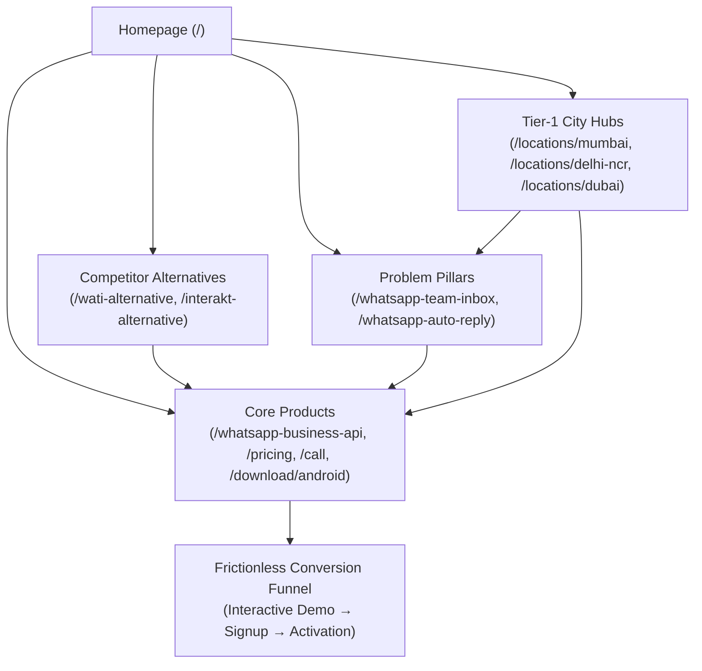

# CHATR SEO Internal Link Graph Architecture

**Objective:** Transform isolated programmatic URLs into a tightly interconnected, high-authority commercial link graph where link equity flows directly to priority conversion pages.

---

## 1. Hub & Spoke Flow

---

## 2. Anchor Text Standards & Linking Rules

1. **Avoid Mechanical Exact-Match Over-Optimization:**
   * Contextual links must read naturally within prose (e.g. *"manage incoming customer conversations using a [shared WhatsApp team inbox](/whatsapp-team-inbox)"* rather than repeated isolated keyword blocks).
2. **Breadcrumb Uniformity:**
   * Every commercial problem and comparison page must feature structured `BreadcrumbList` navigation:
     `Home > Solutions > WhatsApp Team Inbox`
     `Home > Comparisons > WATI Alternative`
3. **Cross-Linking Priority:**
   * Every competitor comparison page (`/wati-alternative`) must link contextually to `/pricing` and `/whatsapp-team-inbox`.
   * Every problem page (`/whatsapp-team-inbox`) must link to `/whatsapp-business-api` and `/pricing`.
   * The Global Footer must maintain direct indexable links to the top commercial money pages.
