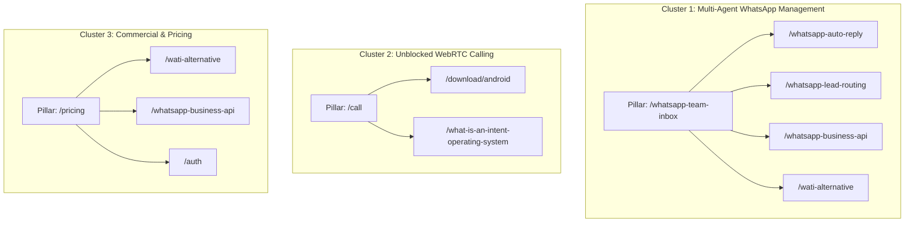

# CHATR SEO Keyword Intent & Topic Cluster Map

**Target Goal:** Map commercial search queries directly to dedicated CHATR product solutions with measurable buyer intent.

---

## 1. Intent Mapping Matrix

| Primary Search Query | Secondary Keywords | User Intent Stage | Target CHATR Route | Core Value Proposition | Interactive Experience | Primary Conversion CTA |
| :--- | :--- | :--- | :--- | :--- | :--- | :--- |
| **"wati alternative"** | wati competitors, wati vs chatr, whatsapp api pricing india | Commercial Switcher (Bottom-of-Funnel) | `/wati-alternative` | Transparent pricing from ₹999/mo, no hidden Meta markups, built-in calling and SI triage | Interactive WATI vs CHATR Savings & Feature Slider | `[Start Free with CHATR]` |
| **"whatsapp team inbox"** | shared whatsapp inbox, multi agent whatsapp, multiple users one whatsapp number | Problem-Solving (High Buyer Intent) | `/whatsapp-team-inbox` | Connect 100+ team members to one WhatsApp number with round-robin lead routing | Live Workflow Simulator: Customer Message → SI Triage → Agent Reply | `[Try the Workflow]` |
| **"whatsapp auto reply"** | whatsapp business automation, instant lead acknowledgment | Problem-Solving (Operational Pain) | `/whatsapp-auto-reply` | 24/7 instant acknowledgment and customer pre-qualification | Test Auto-Reply Simulator with custom prompt | `[Set Up Auto-Reply]` |
| **"whatsapp lead routing"** | round robin whatsapp lead assignment, whatsapp crm india | Problem-Solving (Sales Ops) | `/whatsapp-lead-routing` | Smart routing by agent availability, language, and customer intent | Live Lead Assignment Matrix Simulation | `[Automate Lead Routing]` |
| **"free calling to uae without vpn"** | dubai browser call, unblocked voip uae, browser webrtc calling | Immediate Utility / Viral Funnel | `/call` | 100% free, browser-based WebRTC HD voice and video calling. Zero app install, zero VPN. | 1-Tap Live Guest Call Launcher | `[Start Free Web Call]` |
| **"download chatr apk"** | private caller id android apk, direct apk download no play store | Direct User Acquisition | `/download/android` | Private caller identification and messaging with zero contact upload | 1-Click Verified APK Download button | `[Download Verified APK]` |
| **"chatr pricing"** | whatsapp api cost, sme business messaging plans | Transactional (Ready to Buy) | `/pricing` | Transparent plans starting at ₹999/mo with zero per-agent penalty fees | Interactive ROI / Monthly Conversation Calculator | `[Start 14-Day Free Trial]` |

---

## 2. Topic Cluster Architecture

