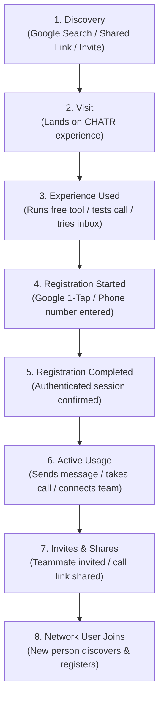
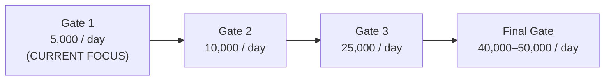

# CHATR STAGE 1 — PROVE REAL USER ACQUISITION
## Executive Operational Blueprint: 0 → 5,000 Registrations/Day

> **Core Mandate:**
> Stop optimizing for vanity metrics (page count, crawler hits, indexation). 
> The sole measure of success is **REAL PEOPLE JOINING AND USING CHATR**.
>
> **Acquisition Ladder:**
> **Gate 1:** 5,000 / day
> **Gate 2:** 10,000 / day
> **Gate 3:** 25,000 / day
> **Final Gate:** 40,000–50,000 / day

---

## 1. The Complete 8-Step User Journey Funnel

Every person who touches CHATR is measured across the full end-to-end journey without gap or guessing:

### Telemetry Implementation
* **Instrumentation Engine:** `src/services/acquisitionTelemetry.ts`
* **Automatic Route Gate:** `src/App.tsx` logs `page_view` and initializes attribution on every single route transition.
* **1-Tap Registration Capture:** `src/components/landing/AuthModal.tsx` and `src/pages/Auth.tsx` record `signup_started` and `signup_completed` across both Google OAuth and Phone OTP.

---

## 2. The 8 Acquisition Sources Matrix

For every acquisition source, CHATR tracks the exact progression:
$$\text{Visitors} \longrightarrow \text{Registrations} \longrightarrow \text{Active Users} \longrightarrow \text{Invites Sent} \longrightarrow \text{New Users Generated}$$

| # | Acquisition Source | Value Proposition | Primary Entry Point | Conversion Mechanism |
|---|--------------------|-------------------|---------------------|----------------------|
| **1** | **Google Organic Search** | Intent-driven problem resolution | Canonical Solution Hubs & Comparison pages | Clear human answers + Above-The-Fold 1-tap trial |
| **2** | **Free Web Utilities** | Instant zero-barrier value | WhatsApp Link Gen, Resume Grader, SLA Calculator | "Save link & manage replies" with Google 1-Tap |
| **3** | **Shared Links & Calls** | Zero-download browser calls | `chatrchat.in/call/:id` | "Claim your permanent link" upon call completion |
| **4** | **Team Invitations** | Collaborative workplace inbox | `chatrchat.in/join?invite=:code` | 1-click team join via Google or Phone OTP |
| **5** | **Direct & Brand Navigation** | All-in-one team app | Homepage (`/`) | Customer-centric hero: "Bring your team, conversations & calls into one place" |
| **6** | **Business Solution Hubs** | Industry-specific workflow | `/solutions/hotel-guest-messaging`, `/solutions/ecommerce-order-tracking` | Focused vertical use case + instant free setup |
| **7** | **Marketplace & Connectors** | Business OS integration | `/marketplace`, `/connectors` | Connect CRM, Email, WhatsApp |
| **8** | **Partnerships & Referrals** | Community & creator distribution | Partner URLs with `?ref=` / `?partner=` | Referral attribution persisted across sessions |

---

## 3. The 5K/Day Executive War Room Dashboard

Live at route: **`/growth`** and **`/desktop/growth`**  
Code: `src/pages/desktop/AcquisitionDashboard.tsx`

### Real-Time Modules
1. **Acquisition Core Cards:**
   * Visitors Today
   * Registrations Today (North Star Metric with progress bar toward 5,000/day)
   * Registration Rate (Visitor → Registered conversion percentage)
   * Active Users Today (People actually using the product)
2. **Sources Funnel Matrix:**
   * Live table detailing Visitors, Registrations, Active Users, Invites Sent, and New Users Generated across all 8 sources.
3. **Top 10 User Entry Points:**
   * Ranked list of top URLs capturing live traffic, signups, and conversion rate.
4. **Global Demand Spread:**
   * Top Countries, Top Languages, and Top Industries derived from actual visitor sessions.
5. **Network Virality Engine:**
   * Invites Sent, Invites Accepted, Shared Links, New Users from Sharing, and the live **K-Factor**.
6. **Business Pipeline:**
   * Business Signups, Teams Created, Team Members Invited, and Active Workspaces.

---

## 4. The Daily Decision Framework (8 Operational Questions)

The system automatically synthesizes data to answer these 8 questions every morning:

1. **Where did today's new users come from?**
   * *Answer:* Identifies the highest-volume source (e.g. Free Web Utilities or Google Organic Search).
2. **What caused them to register?**
   * *Answer:* Evaluates the specific trigger (e.g. Google 1-Tap OAuth on WhatsApp Link Generator or Permanent Call Link claim).
3. **Which experience converted best?**
   * *Answer:* Ranks entry experiences by conversion rate (>15% vs standard 2%).
4. **Which country/market is growing fastest?**
   * *Answer:* Highlights leading geographic demand (e.g. India, UAE/Gulf, Southeast Asia, US).
5. **Which business category is responding best?**
   * *Answer:* Determines top industry adoption (e.g. Hospitality & Hotels, E-Commerce, Recruitment).
6. **What should we improve today?**
   * *Answer:* Focuses on optimizing the single highest-leverage conversion bottleneck.
7. **What should we stop doing?**
   * *Answer:* Halts low-yield activities (e.g. thin programmatic page generation without search demand).
8. **What can we replicate globally?**
   * *Answer:* Takes the top-converting local experience and translates/localizes it for the next country.

---

## 5. The Growth Gates

* **Gate 1 (0 → 5,000/day):** Prove conversion and activation on core web tools, homepage, and canonical solution pages.
* **Gate 2 (10,000/day):** Multi-engine compounding (Organic Search + Free Tools + Viral Invites).
* **Gate 3 (25,000/day):** International expansion into UAE/Gulf, Southeast Asia, and Europe.
* **Final Gate (40,000–50,000/day):** Global two-sided marketplace operating at massive scale.
