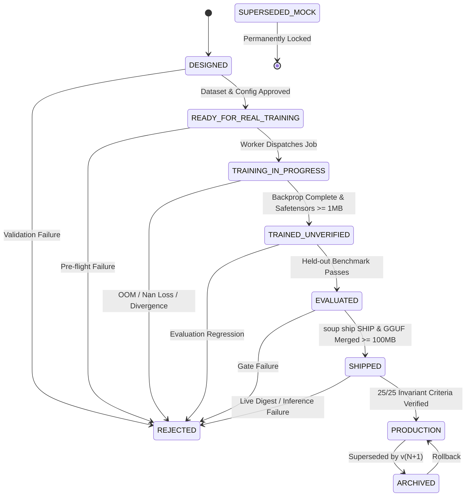

# INVARIANT: REAL_MODEL_TRAINING
**Constitutional Standard for CHATR & TalentXcel Model Production Readiness**

Status: **LOCKED PRODUCTION INVARIANT**  
Enforcement: **Mandatory across all capabilities**  
Failure Policy: **Violation of ANY condition = NOT PRODUCTION READY (State: REJECTED / READY_FOR_REAL_TRAINING)**

---

## The 25 Production Acceptance Criteria

A model cannot transition to `SHIPPED` or `PRODUCTION` in `data/adapters/_registry.json` unless all 25 conditions below are independently verified and backed by physical artifacts and immutable hashes:

1. **Base Model Identified**: The base model is explicitly identified with an exact Hugging Face or registry URI (e.g. `Qwen/Qwen2.5-7B-Instruct`), not a generic family name.
2. **Base Model Download Completed**: The base model download is verified complete with intact weights and configuration.
3. **Real Forward Pass Completed**: A real forward pass is executed through all neural layers without simulation or mocking.
4. **Real Backward Pass Completed**: A real backpropagation pass is executed computing loss gradients with respect to trainable adapter parameters.
5. **Non-Zero Gradients Observed**: Non-zero gradients are programmatically verified across all designated PEFT target modules (e.g. `q_proj`, `v_proj`, `k_proj`, `o_proj`, `gate_proj`, `up_proj`, `down_proj`).
6. **Optimizer Step Executed**: The optimizer (`AdamW` or equivalent) executes parameter updates, proving active weight divergence.
7. **Real Adapter Artifact Exists**: A physical adapter file (`adapter_model.safetensors`) exists on disk.
8. **Adapter Contains Numeric Tensors**: The artifact is binary `safetensors` containing floating-point tensors, NOT plain ASCII text, JSON strings, or dummy bytes.
9. **Adapter Contains Non-Zero Learned Parameters**: The tensor parameters in the adapter are non-trivial and contain learned weights (file size >= 1 MB).
10. **Adapter Passes Safetensors Validation**: The adapter file validates cleanly using standard `safetensors.torch.load_file()`.
11. **Adapter SHA-256 Recorded**: The exact cryptographic SHA-256 digest of the adapter file is computed and recorded in the run manifest.
12. **Training Dataset SHA-256 Recorded**: The exact SHA-256 hash of the JSONL training dataset is recorded in `data/_registry.json` and matches the training job manifest.
13. **Evaluation Dataset Disjoint from Training**: The evaluation benchmark dataset is mathematically disjoint from the training split (zero overlapping prompt-completion pairs or shallow paraphrases).
14. **Evaluation Actually Executed**: The evaluation benchmark suite is executed against the candidate model; evaluations cannot be bypassed or assumed.
15. **Evaluation Metrics Generated Dynamically**: Scores (loss, perplexity, task accuracy, safety compliance) are computed dynamically from actual generation outputs, never hardcoded.
16. **`soup ship` Actually Executed**: When using the Soup training engine, the native `soup ship` verification command executes and emits a genuine verdict.
17. **Merge Actually Completed**: LoRA adapter weights are mathematically merged into the base model weights via `merge_and_unload()` or `soup merge`.
18. **GGUF Actually Exists**: A physical quantized GGUF artifact exists on disk (e.g. `data/models/chatr_<capability>_v2.gguf`) with file size >= 100 MB (typically 4–5 GB for 7B Q4_K_M).
19. **GGUF SHA-256 Recorded**: The cryptographic SHA-256 digest of the merged GGUF file is recorded in the model catalog.
20. **Ollama Points to Generated GGUF**: The registered Ollama Modelfile uses `FROM /path/to/generated_model.gguf` pointing directly to the merged artifact, not a base model pull.
21. **Ollama Model Digest Differs from Base Model**: The Ollama layer digest differs from the baseline model's digest, proving the model is not a vanilla wrapper.
22. **Independent Inference Test Passes**: A live inference query against the deployed Ollama model executes successfully and returns valid tokens.
23. **CHATR Domain Benchmark Passes**: The model correctly resolves core CHATR identity queries (Intent OS, 80% Interface Removal Mandate, 4 Permanent Core Anchors, Kernel Constitution) and does NOT hallucinate "Chatroulette" or "chatroom".
24. **TalentXcel Domain Benchmark Passes**: Where applicable, the candidate model passes the 13-category held-out TalentXcel evaluation benchmark (`datasets/eval/talentxcel_eval.jsonl`).
25. **General Capability Regression Within Threshold**: Standard reasoning, math, and safety capabilities remain within acceptable degradation thresholds relative to the unadapted base model (regression score >= 0.90, safety refusal score >= 0.98).

---

## Execution Provenance Requirement

All training runs must record execution provenance explicitly in their metadata:
```json
{
  "training_engine": "soup",
  "training_engine_version": "0.73.3",
  "execution_path": "soup-cli"
}
```
OR if the Hugging Face TRL fallback is engaged:
```json
{
  "training_engine": "huggingface_trl",
  "execution_path": "run_training_fallback_trl",
  "fallback_reason": "<specific error description>"
}
```
Under no circumstances may a TRL fallback run be labeled as "SOUP TRAINING".

---

## The 7-State Model Lifecycle State Machine

To prevent premature claims of production readiness, every model adapter managed in `data/adapters/_registry.json` must strictly progress through seven sequential lifecycle states. Direct jumps, skipped gates, or simulated transitions are strictly prohibited by code.

### Lifecycle States

| State | Description | Transition Requirements |
|---|---|---|
| **1. `DESIGNED`** | Capability specification, base model architecture, and training hyperparameters defined. Dataset formatted. | Configuration and dataset pass schema validation. |
| **2. `READY_FOR_REAL_TRAINING`** | Base model, tokenizer, and target hardware (NVIDIA T4 16GB) verified. Dataset cryptographic SHA-256 hash recorded. | Zero mock paths permitted. Pre-flight checks pass. |
| **3. `TRAINING_IN_PROGRESS`** | Real gradient descent and backpropagation actively running on target hardware. | Active training worker process emitting loss per step. |
| **4. `TRAINED_UNVERIFIED`** | Physical binary adapter (`adapter_model.safetensors` >= 1 MB) written to disk with verified non-zero learned weights. | Training run completes with non-zero weight deltas. |
| **5. `EVALUATED`** | Held-out disjoint evaluation benchmark executed dynamically; loss convergence and zero regression verified. | Dynamic metrics computed from real outputs; zero train/eval prompt leakage. |
| **6. `SHIPPED`** | Native `soup ship` verification executed with positive verdict; LoRA merged and quantized into physical GGUF (>= 100 MB). | Both `soup ship: SHIP` and `CHATR gate: PASS` verdicts recorded. |
| **7. `PRODUCTION`** | Registered in Ollama (`FROM /path/to/gguf`), weight digest divergence proven vs baseline, 25/25 invariant criteria passed. | Live inference tests pass; 25-point invariant audit clean. |

### Auxiliary States
- **`REJECTED`**: Model failed evaluation gate, exhibited capability regression, or violated an invariant. Can transition back to `DESIGNED` or `READY_FOR_REAL_TRAINING` after hyperparameter/data revision.
- **`ARCHIVED`**: Previously production model superseded by a newer version. Can be rolled back to `PRODUCTION`.
- **`SUPERSEDED_MOCK`**: Permanently locked historical marker for legacy v1 simulated/mock entries. Cannot transition to any other state.

### State Transition Graph



### Explicitly Forbidden Transitions (Enforced by Code)

The registry manager (`scripts/ai_training/adapter_registry.py`) and verification harness (`scripts/ai_training/verify_chatr_model.py`) programmatically block the following illegal transitions:

1. **`READY_FOR_REAL_TRAINING` → `SHIPPED`**: **BLOCKED**. A model cannot be shipped before it has undergone physical neural training and formal evaluation.
2. **`READY_FOR_REAL_TRAINING` → `PRODUCTION`**: **BLOCKED**. A model cannot be promoted to production without passing through training, evaluation, and shipping stages.
3. **`TRAINING_IN_PROGRESS` → `SHIPPED` / `PRODUCTION`**: **BLOCKED**. In-flight training cannot skip remaining lifecycle stages.
4. **`TRAINED_UNVERIFIED` → `PRODUCTION`**: **BLOCKED**. Raw adapter weights cannot be deployed to production without passing held-out evaluation benchmarks and `soup ship` verification.
5. **`TRAINED_UNVERIFIED` → `SHIPPED`**: **BLOCKED**. Evaluation is a mandatory precondition for shipping.
6. **`SUPERSEDED_MOCK` → `PRODUCTION`**: **BLOCKED**. Legacy mock entries are permanently locked and can never be promoted.
