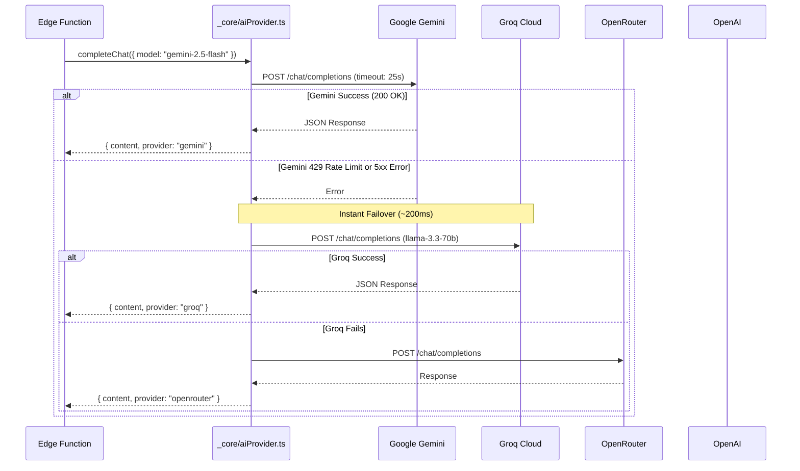

# Phase 2A: CHATR AI Provider Architecture & Routing Map

## 1. Deep Architecture of `_core/aiProvider.ts`

The CHATR AI Router ([`supabase/functions/_core/aiProvider.ts`](file:///c:/Users/Arshid.Wani/chatrchat/supabase/functions/_core/aiProvider.ts)) is a dependency-free Deno module providing unified failover, streaming, vector embedding, and image generation.

### Verified Source Code Properties
- **Supported Providers (`AIProviderName`):** `"gemini" | "groq" | "openrouter" | "openai"`
- **Default Timeout:** `25,000ms` (configurable per request via `options.timeoutMs`, enforced by `AbortController`)
- **Error Handling:** Throws structured `PlatformError` (`503 ai_providers_exhausted`) capturing error messages from all tried providers.

### Exported Router Methods
1. `completeChat(options: ChatCompletionOptions): Promise<ChatCompletionResult>`
   - Primary default: `gemini`
   - Default failover chain: `[gemini → groq → openrouter → openai]`
   - Supports `responseFormat: { type: "json_object" }`
   - Returns normalized `{ content, provider, model, raw, usage }`
2. `streamChat(options: ChatCompletionOptions): Promise<Response>`
   - Dispatches chunked SSE stream directly from active provider to client.
   - Headers: `Content-Type: text/event-stream`, `Cache-Control: no-cache`.
3. `generateEmbedding(options: EmbeddingOptions): Promise<EmbeddingResult>`
   - **Primary Model:** `text-embedding-004` via Google Generative Language native endpoint (`embedContent`).
   - **Fixed Dimension:** Strictly outputs **768 dimensions** for binary parity with `communication_memory`.
   - **Failover:** OpenRouter embedding endpoint (`google/text-embedding-004`).
4. `generateImage(options: ImageGenerationOptions): Promise<ImageGenerationResult>`
   - Primary: OpenAI `dall-e-3` direct endpoint.
   - Failover: Fallback to high-resolution placeholder asset.

---

## 2. Provider Endpoints & Default Configurations

| Provider | Endpoint URL | Default Model | Secret Name (Names Only) | Role in CHATR OS |
|---|---|---|---|---|
| **Google Gemini** | `https://generativelanguage.googleapis.com/v1beta/openai/chat/completions` | `gemini-2.5-flash` | `GEMINI_API_KEY` (or `GOOGLE_AI_API_KEY`) | **Primary Chat & 768-dim Embeddings** |
| **Groq Cloud** | `https://api.groq.com/openai/v1/chat/completions` | `llama-3.3-70b-versatile` | `GROQ_API_KEY` | **First-level Ultra-Fast Failover (<300ms)** |
| **OpenRouter** | `https://openrouter.ai/api/v1/chat/completions` | `google/gemini-2.5-flash` | `OPENROUTER_API_KEY` | **Secondary Multi-Vendor Failover** |
| **OpenAI Direct**| `https://api.openai.com/v1/chat/completions` | `gpt-4o-mini` | `OPENAI_API_KEY` | **Final Chat Tier, STT (`whisper-1`), TTS (`tts-1`), DALL-E 3** |

---

## 3. Failover Execution Flow

---

## 4. Normalization Engine

The router automatically normalizes model identifiers to prevent cross-provider naming conflicts:
- In `gemini`: Strips `google/` prefixes and `-preview` suffixes.
- In `groq`: Strips `meta-llama/` prefixes.
- In `openai`: Strictly maps to standard OpenAI model IDs (`gpt-4o-mini`, `o1`, `o3`).
