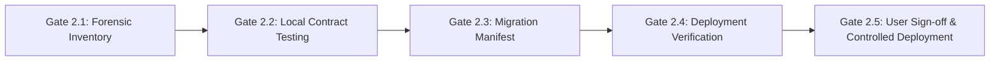

# Phase 2: CHATR AI Gateway Implementation Plan & Migration Gates

## 1. Objective & Execution Principles

Transition all 39 Supabase Edge Functions with legacy Lovable dependencies from `ai.gateway.lovable.dev` to CHATR's native multi-provider AI Router (`_core/aiProvider.ts`).

### Strict Principles
1. **Zero Client Changes:** All request and response contracts remain byte-compatible with the frontend.
2. **Read-Only First:** No production secrets set, no functions deployed, and no schema altered until explicit user approval.
3. **Clinical & Health Safety Integrity:** System prompts, safety constraints, and triage disclaimers remain 100% unaltered.
4. **Vector Memory Frozen:** Zero alterations to embedding models or vector table schemas during Phase 2.
5. **Secret Hygiene:** Secret names only (`GEMINI_API_KEY`, `GROQ_API_KEY`, `OPENAI_API_KEY`, `OPENROUTER_API_KEY`). Never expose actual key values.

---

## 2. Phase 2 Gated Execution Pipeline

### Gate 2.1 — Forensic Inventory (Status: ✅ COMPLETE)
- Complete AST analysis of all 149 functions across `lovable/main` and local `chore/lovable-exit`.
- Full caller correlation against all frontend components in `src/`.
- Documented in [`02-ai-gateway-inventory.md`](file:///c:/Users/Arshid.Wani/chatrchat/docs/lovable-exit/02-ai-gateway-inventory.md), [`02b-ai-provider-map.md`](file:///c:/Users/Arshid.Wani/chatrchat/docs/lovable-exit/02b-ai-provider-map.md), [`02c-function-contract-matrix.md`](file:///c:/Users/Arshid.Wani/chatrchat/docs/lovable-exit/02c-function-contract-matrix.md), and [`02d-ai-migration-risks.md`](file:///c:/Users/Arshid.Wani/chatrchat/docs/lovable-exit/02d-ai-migration-risks.md).

### Gate 2.2 — Local Contract Testing (Status: 🟡 READY FOR EXECUTION)
- Execute non-production test invocations against local Deno Edge runtime.
- Verify request parsing, failover chaining, and response JSON schemas.
- Verify that simulated HTTP 429 from primary provider triggers automatic provider failover within the configured router timeout (25,000ms default).

### Gate 2.3 — Migration Manifest (Status: ✅ DOCUMENTED BELOW)
- Complete function-by-function transition mapping.

### Gate 2.4 — Deployment Mechanism Confirmation (Status: 🟡 PENDING USER SELECTION)
- Because `sbayuqgomlflmxgicplz` is hosted under the Lovable Supabase organization:
  - **Option 1 (Recommended / Zero Risk):** Paste updated function code and secret names directly via the Supabase Project Dashboard UI (`Settings -> Edge Functions`).
  - **Option 2:** Deploy via personal access token bound to the project if org-level credentials are provided.

### Gate 2.5 — Explicit Production Approval (Status: 🔴 LOCKED UNTIL USER SIGNOFF)
- Absolute gate: No deployment or secret creation occurs without explicit user instruction.

---

## 3. Comprehensive Migration Manifest (All 39 Functions)

| # | Function | Current Lovable Provider & Model | Target Provider | Target Model | Failover Chain | Streaming? | Secrets Required | Risk Level | Rollback Path |
|---|---|---|---|---|---|---|---|---|---|
| 1 | `chatr-world` | Lovable `gemini-2.5-flash` | Gemini Direct | `gemini-2.5-flash` | Groq → OpenRouter | No | `GEMINI_API_KEY`, `GROQ_API_KEY` | Low | Revert commit |
| 2 | `ai-agent-chat` | Lovable `gemini-2.5-flash` | Gemini Direct | `gemini-2.5-flash` | Groq → OpenRouter | **Yes (SSE)** | `GEMINI_API_KEY`, `GROQ_API_KEY` | Medium | Revert commit |
| 3 | `chatr-world-ai` | Lovable `gemini-2.5-flash` | Gemini Direct | `gemini-2.5-flash` | Groq → OpenRouter | No | `GEMINI_API_KEY` | Low | Revert commit |
| 4 | `ai-chat-assistant` | Lovable `gemini-2.5-flash` | Gemini Direct | `gemini-2.5-flash` | Groq → OpenRouter | No | `GEMINI_API_KEY` | Low | Revert commit |
| 5 | `ai-browser-search` | Lovable `gemini-2.5-flash` | Gemini Direct | `gemini-2.5-flash` | Groq + Serper | No | `GEMINI_API_KEY`, `SERPER_API_KEY` | Low | Revert commit |
| 6 | `ai-image-generator` | Lovable DALL-E | OpenAI Direct | `dall-e-3` | Stock placeholder | No | `OPENAI_API_KEY` | Low | Revert commit |
| 7 | `auto-translate` | Lovable `gemini-2.5-flash` | Gemini Direct | `gemini-2.5-flash-lite` | Groq → OpenRouter | No | `GEMINI_API_KEY` | Low | Revert commit |
| 8 | `translate-message` | Lovable `gemini-2.5-flash-lite` | Gemini Direct | `gemini-2.5-flash-lite` | Groq → OpenRouter | No | `GEMINI_API_KEY` | Low | Revert commit |
| 9 | `visual-intelligence` | Lovable `gemini-2.5-flash` | Gemini Direct | `gemini-2.5-flash` | OpenRouter | No | `GEMINI_API_KEY` | Low | Revert commit |
| 10 | `ai-message-insights` | Lovable `gemini-2.5-flash-lite` | Gemini Direct | `gemini-2.5-flash-lite` | Groq → OpenRouter | No | `GEMINI_API_KEY` | Low | Revert commit |
| 11 | `cc-ai-ceo` | Lovable `gemini-2.5-flash` | Gemini Direct | `gemini-2.5-flash` | Groq → OpenRouter | No | `GEMINI_API_KEY` | Low | Revert commit |
| 12 | `cc-engineering-agent` | Lovable `gemini-2.5-flash` | Gemini Direct | `gemini-2.5-flash` | Groq → OpenRouter | No | `GEMINI_API_KEY` | Low | Revert commit |
| 13 | `cc-sales-agent` | Lovable `gemini-2.5-flash` | Gemini Direct | `gemini-2.5-flash` | Groq → OpenRouter | No | `GEMINI_API_KEY` | Low | Revert commit |
| 14 | `chatr-brain` | Lovable `gemini-2.5-flash` | Gemini Direct | `gemini-2.5-flash` | Groq → OpenRouter | No | `GEMINI_API_KEY` | Low | Revert commit |
| 15 | `chatr-plus-ai-search` | Lovable `gemini-2.5-flash` | Gemini Direct | `gemini-2.5-flash` | Groq → OpenRouter | No | `GEMINI_API_KEY` | Low | Revert commit |
| 16 | `detect-video-objects` | Lovable `gemini-2.5-flash` | Gemini Direct | `gemini-2.5-flash` | OpenRouter | No | `GEMINI_API_KEY` | Low | Revert commit |
| 17 | `generate-sticker` | Lovable DALL-E 3 | OpenAI Direct | `dall-e-3` | Stock placeholder | No | `OPENAI_API_KEY` | Low | Revert commit |
| 18 | `health-predictions` | Lovable `gemini-2.5-flash` | Gemini Direct | `gemini-2.5-flash` | Groq → OpenRouter | No | `GEMINI_API_KEY` | Medium (Health) | Revert commit |
| 19 | `medication-interactions` | Lovable `gemini-2.5-flash` | Gemini Direct | `gemini-2.5-flash` | Groq → OpenRouter | No | `GEMINI_API_KEY` | Medium (Health) | Revert commit |
| 20 | `mental-health-assistant` | Lovable `gemini-2.5-flash` | Gemini Direct | `gemini-2.5-flash` | Groq → OpenRouter | No | `GEMINI_API_KEY` | Medium (Health) | Revert commit |
| 21 | `nutrition-tracker` | Lovable `gemini-2.5-flash` | Gemini Direct | `gemini-2.5-flash` | Groq → OpenRouter | No | `GEMINI_API_KEY` | Medium (Health) | Revert commit |
| 22 | `symptom-checker` | Lovable `gemini-2.5-flash` | Gemini Direct | `gemini-2.5-flash` | Groq → OpenRouter | No | `GEMINI_API_KEY` | Medium (Health) | Revert commit |
| 23 | `screen-incoming-call` | Lovable `gemini-2.5-flash-lite` | Rules / Regex | Local Engine | None | No | None | Low | Revert commit |
| 24 | `search-suggestions` | Lovable `gemini-2.5-flash-lite` | Gemini Direct | `gemini-2.5-flash-lite` | Groq → OpenRouter | No | `GEMINI_API_KEY` | Low | Revert commit |
| 25 | `visual-search` | Lovable `gemini-2.5-flash` | Gemini Direct | `gemini-2.5-flash` | OpenRouter | No | `GEMINI_API_KEY` | Low | Revert commit |
| 26 | `ai-chat-summary` | Lovable `gemini-2.5-flash-lite` | Gemini Direct | `gemini-2.5-flash-lite` | Groq → OpenRouter | No | `GEMINI_API_KEY` | Low | Revert commit |
| 27 | `ai-clone-respond` | Lovable `gemini-2.5-flash` | Gemini Direct | `gemini-2.5-flash` | Groq → OpenRouter | No | `GEMINI_API_KEY` | Low | Revert commit |
| 28 | `ai-voice-summarize` | Lovable `gemini-2.5-flash-lite` | Gemini Direct | `gemini-2.5-flash-lite` | Groq → OpenRouter | No | `GEMINI_API_KEY` | Low | Revert commit |
| 29 | `perplexity-search` | Lovable `gemini-2.5-flash` | Gemini Direct | `gemini-2.5-flash` | Groq → OpenRouter | No | `GEMINI_API_KEY` | Low | Revert commit |
| 30 | `smart-compose` | Lovable `gemini-2.5-flash-lite` | Gemini Direct | `gemini-2.5-flash-lite` | Groq → OpenRouter | No | `GEMINI_API_KEY` | Low | Revert commit |
| 31 | `smart-notification-orchestrator` | Lovable `gemini-2.5-flash-lite` | Gemini Direct | `gemini-2.5-flash-lite` | Groq → OpenRouter | No | `GEMINI_API_KEY` | Low | Revert commit |
| 32 | `smart-push-engine` | Lovable `gemini-2.5-flash` | Gemini Direct | `gemini-2.5-flash` | Groq → OpenRouter | No | `GEMINI_API_KEY` | Low | Revert commit |
| 33 | `summarize-chat` | Lovable `gemini-2.5-flash-lite` | Gemini Direct | `gemini-2.5-flash-lite` | Groq → OpenRouter | No | `GEMINI_API_KEY` | Low | Revert commit |
| 34 | `universal-search-engine` | Lovable `gemini-2.5-flash` | Gemini Direct | `gemini-2.5-flash` | Groq → OpenRouter | No | `GEMINI_API_KEY` | Low | Revert commit |
| 35 | `web-search-aggregator` | Lovable `gemini-2.5-flash` | Gemini Direct | `gemini-2.5-flash` | Groq → OpenRouter | No | `GEMINI_API_KEY` | Low | Revert commit |
| 36 | `transcribe-voice` | OpenAI `whisper-1` | OpenAI Direct | `whisper-1` | Web Speech API | No | `OPENAI_API_KEY` | Low | Revert commit |
| 37 | `agent-voice-tts` | OpenAI `tts-1` | OpenAI Direct | `tts-1` | Web Speech API | No | `OPENAI_API_KEY` | Low | Revert commit |
| 38 | `voice-stt` | Lovable `whisper-1` | Replaced by `transcribe-voice` | `whisper-1` | Web Speech API | No | `OPENAI_API_KEY` | Low | Revert commit |
| 39 | `voice-ai-stream` | Lovable `gemini-2.5-flash` | Replaced by `ai-agent-chat` | `gemini-2.5-flash` | Groq → OpenRouter | **Yes (SSE)** | `GEMINI_API_KEY` | Low | Revert commit |
